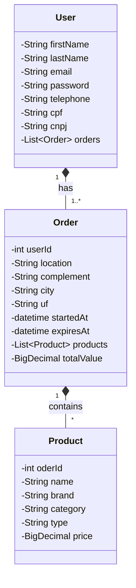

# Luz Camera Ação - API

# :scroll: Descrição

API REST em Java 17 para uma aplicação web de aluguel de equipamentos para produções audio visuais.

Conta com gerenciamento e ciração de usuarios, produtos e pedidos - autenticação via JWT e persistência em banco relacional na nuvem.

<s> :seedling: API - https://luzcameraacao-api.up.railway.app/ </s>

<s> :notebook_with_decorative_cover: Doc -https://luzcameraacao-api.up.railway.app/swagger-ui.html </s>

## :wrench: Funcionalidades

- *Login*
- *Autenticação JWT Token*
- *Crud de usuário*
- *Crud de produtos*
- *Crud de pedidos*

## :toolbox: Tecnologias

- Java
- Spring Boot
- JPA / Hibernate
- Postgres
- JSON Web Token
- Swagger
- Gradle
- JUnit

## Diagrama de Classes

