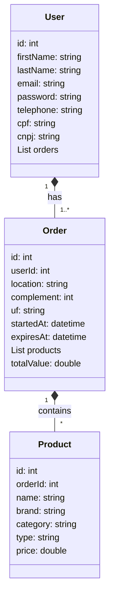

# Luz Camera Ação - API

## Diagram de Classes

```mermaid
classDiagram
    class User {
        id: int
        firstName: string
        lastName: string
        email: string
        password: string
        telephone: string
        cpf: string
        cnpj: string
        List<Order> orders
    }
    
    class Order {
        id: int
        userId: int
        location: string
        complement: int
        uf: string
        startedAt: datetime
        expiresAt: datetime
        List<Product> products
        totalValue: double
    }
    
    class Product {
        id: int
        orderId: int
        name: string
        brand: string
        category: string
        type: string
        price: double
    }
    
    User "1" *-- "1..*" Order : has
    Order "1" *-- "*" Product : contains
```